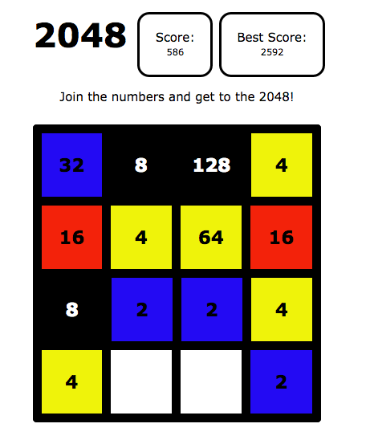

# 2048

[Link][Link]

[Link]: http://www.steph-zhu.com/2048_red_blue_yellow/

2048 is a web browser game utilizing the powers of twos.  The simple browser game is built in Javascript, HTML/CSS.

- Use the arrow keys to swipe left, right, up, down.
- User wins when one of the tiles reaches 2048.

